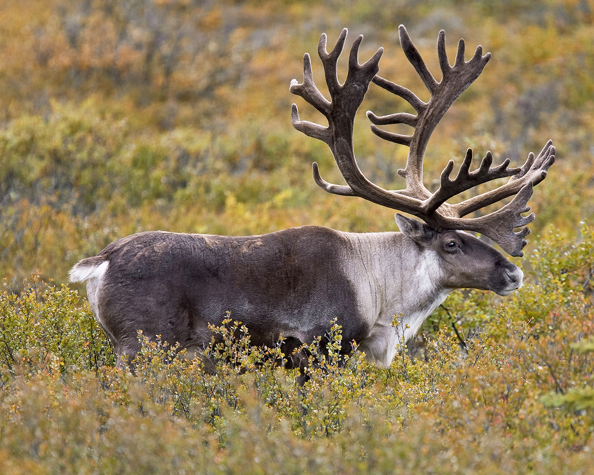

# Collaborative Project

This project is for us to learn how to code in R while saving it to github and to work with others. This will help us with future collaborations and resolving any errors which may come with that. 

## Files

- plots.R
Code to produce a scatterplot based on the mtcars package
- Teamwork.md 
Our teamwork contract of how we will divide our labour
-Readme.md
This current file

Clickable hyperlink to class page:
[STAT545 webpage] (https://ubc-stat.github.io/stat545/)

 #! makes the photo show
[uploaded photo of caribou](img/photo.jpg) #without ! is just clickable link

Contents of all folders

- `TEAMWORK.Rmd`: contract of group member's obligations
- `README.md`: various info and misc
- `plots.R`: mtcars plots
-`img`: caribou titled "photo.jpg"
-collab-proj-template.Rproj`: The 'settings' panel
-`.Rhistory`: log of commands in R console. Empty currently
-`.gitignore`: Things to not include in Git